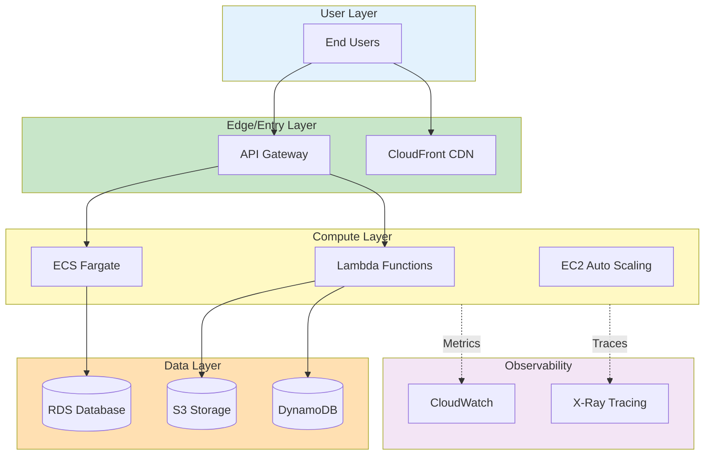
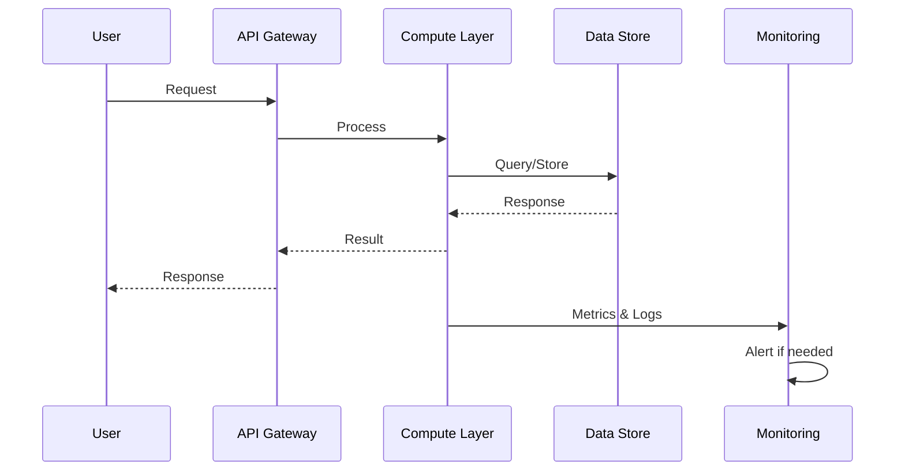
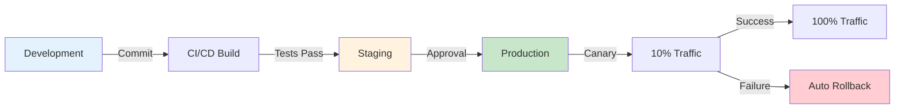

# Edge AI Inference Platform

> **Production-grade edge computing with AWS Wavelength zones, IoT Greengrass, sub-10ms latency**

[](https://aws.amazon.com/)
[](https://github.com/rahulladumor)
[](LICENSE)

## 📋 Table of Contents

- [Overview](#-overview)
- [Architecture](#-architecture)
- [Features](#-features)
- [Getting Started](#-getting-started)
- [Deployment](#-deployment)
- [Monitoring](#-monitoring)
- [Security](#-security)
- [Cost](#-cost)
- [License](#-license)

## 🎯 Overview

Production-grade edge computing with AWS Wavelength zones, IoT Greengrass, sub-10ms latency

### Key Capabilities
- High availability and fault tolerance
- Auto-scaling and cost optimization
- Security best practices
- Production-ready monitoring

---

## 🏗️ Architecture

### System Architecture



### Data Flow



### Deployment Pipeline



---

## ✨ Features

1. **High Availability** - Multi-AZ deployment with automatic failover
2. **Auto Scaling** - Dynamic scaling based on demand
3. **Security** - End-to-end encryption, IAM roles, VPC isolation
4. **Monitoring** - CloudWatch dashboards, alerts, and X-Ray tracing
5. **Cost Optimized** - Right-sized resources with auto-shutdown
6. **CI/CD Ready** - Automated deployment pipeline
7. **Disaster Recovery** - Automated backups and restore
8. **Compliance** - Security best practices and audit logging

---

## 🚀 Getting Started

### Prerequisites

```bash
# AWS CLI
aws --version  # >= 2.13.0

# Infrastructure tool (varies by project)
node --version     # >= 18.0.0 (for CDK)
terraform version  # >= 1.5.0 (for Terraform)
pulumi version     # >= 3.90.0 (for Pulumi)
```

### Quick Deploy

See [ARCHITECTURE.md](ARCHITECTURE.md) for detailed deployment instructions.

---

## 📊 Monitoring

- **CloudWatch Dashboards** - Real-time metrics
- **CloudWatch Alarms** - Automated alerting
- **X-Ray Tracing** - Distributed request tracing
- **VPC Flow Logs** - Network monitoring

---

## 🔐 Security

- ✅ Encryption at rest and in transit
- ✅ IAM least privilege access
- ✅ VPC network isolation
- ✅ Security group restrictions
- ✅ CloudTrail audit logging
- ✅ AWS Config compliance

---

## 💰 Cost Estimation

**Monthly Estimate**: Varies by usage

- Development: $100-500/month
- Production: $500-5000/month

See detailed cost breakdown in documentation.

---

## 📝 License

MIT License - see [LICENSE](LICENSE)

## 👤 Author

**Rahul Ladumor**
- Portfolio: [acloudwithrahul.in](https://acloudwithrahul.in)
- GitHub: [@rahulladumor](https://github.com/rahulladumor)
- Email: rahuldladumor@gmail.com

---

⭐ Star this repo if you find it helpful!
